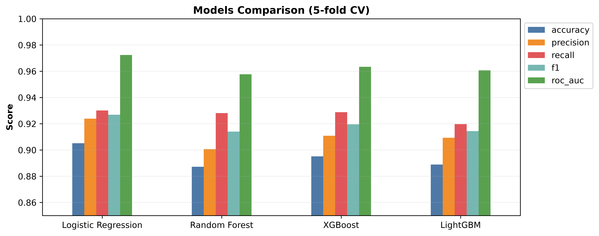

# ML Portfolio Project

Two supervised learning problems solved end to end, with a React and FastAPI web app on top of the final models.

- Part 1: Classification, predicting whether an e-commerce order will be returned (done)
- Part 2: Regression, predicting influencer campaign revenue (coming soon)
- Part 3: Web app with React frontend and FastAPI backend (coming soon)

## Repo structure

```
ml-portfolio-project/
  ml/
    data/          datasets (git ignored)
    notebooks/     analysis notebooks, in order
    src/           reusable code (pipeline, train helpers)
    figures/       saved charts
  backend/
    models/        saved final models (joblib)
  frontend/        React app
  requirements.txt
```

---

# Part 1: Return Risk Classification

## 1. Problem definition

Online fashion stores lose money on returned orders: shipping both ways, handling, and items that can no longer be sold at full price. If the store knows which orders are likely to come back, it can act before the order ships.

- Target: `return_risk_label` (1 = returned, 0 = kept)
- Task: binary classification
- Features (12): `cart_value_usd`, `past_return_rate`, `size_bracketing_flag`, `delivery_days_taken`, `discount_pct_applied`, `product_category`, `fit_review_sentiment`, `newsletter_subscriber`, `browser_used`, `checkout_device`, `packaging_color`, `loyalty_card_color`
- How ML helps: the model scores every order with a return probability, so the business can flag risky orders and handle them differently from safe ones.

## 2. Data understanding and EDA

Notebook: `01_classification_eda.ipynb`

- About 3,000 orders, 12 features plus the target
- No missing values and no duplicate rows
- Class balance: 64.5% returned, 35.5% kept. This is mild imbalance. A model that always says "returned" would get 64.5% accuracy, so that is the number any model has to beat.
- Checked data types, descriptive statistics, distributions, box plots for outliers, and a correlation heatmap of the numeric columns.
- Checked for negative values in the numeric columns.

## 3. Data preprocessing

Notebooks: `01_classification_eda.ipynb`, `02_classification_preprocessing.ipynb`

**Outliers**
- Box plots showed outliers in the continuous columns.
- Capped them using the IQR method (1.5 x IQR) on `cart_value_usd`, `past_return_rate`, `delivery_days_taken` and `discount_pct_applied`.
- The 0/1 columns and the target were left alone, since IQR capping would break them.

**Encoding and scaling** (built in `src/pipeline.py`)
- Numeric columns: median imputation, then standard scaling
- Categorical columns: most frequent imputation, then one hot encoding
- `size_bracketing_flag` and `newsletter_subscriber` are already 0/1, so they pass through unchanged

**Split**
- 80% train and 20% test (2,394 and 599 rows)
- Stratified on the target, so both parts keep the 64.5 / 35.5 ratio
- `random_state=42`
- The test set was not touched until the final evaluation

## 4. Feature selection

Feature selection runs inside the pipeline, after preprocessing, using ANOVA F-test (`SelectKBest` with `f_classif`).

- After one hot encoding there are 26 columns.
- ANOVA scores each column on how well it separates returned orders from kept orders, and keeps the top `k`.
- `k` was treated as a hyperparameter and tuned. The best value was 20.
- Because selection sits inside the pipeline, it is redone inside every CV fold. This avoids leaking information from the validation part into the selection step.

**Features kept (20 of 26)**
- Numeric: cart value, past return rate, delivery days, discount percentage
- `product_category` (all 4 dummy columns)
- `fit_review_sentiment` (all 3 dummy columns)
- `browser_used` (all 4 dummy columns)
- `packaging_color` (all 3 dummy columns)
- `size_bracketing_flag` and `newsletter_subscriber`

**Features dropped**
- `checkout_device` (all 3 columns)
- `loyalty_card_color` (all 3 columns)

## 5. Models and cross validation

Four models were compared, all inside the same pipeline (preprocessing, then ANOVA, then model), with stratified 5-fold cross validation on the training set only.

Why these four:
- **Logistic Regression:** simple, fast, easy to explain, and a strong baseline for a binary target with mixed features
- **Random Forest:** handles non linear patterns and interactions without much tuning
- **XGBoost:** gradient boosting, usually strong on tabular data
- **LightGBM:** another boosting model, faster, good on smaller datasets too

**CV results (mean of 5 folds)**

| Model | Accuracy | Precision | Recall | F1 | ROC-AUC |
|---|---|---|---|---|---|
| Logistic Regression | 0.905 | 0.924 | 0.930 | 0.927 | 0.972 |
| Random Forest | 0.887 | 0.901 | 0.928 | 0.914 | 0.958 |
| XGBoost | 0.895 | 0.911 | 0.929 | 0.920 | 0.963 |
| LightGBM | 0.889 | 0.909 | 0.920 | 0.914 | 0.961 |

Logistic Regression was ahead on every metric. The tree models ran on fixed, reasonable settings and were not tuned.



## 6. Hyperparameter tuning

GridSearchCV (5-fold, scored on F1) on the Logistic Regression pipeline.

| Parameter | Values tried | Best |
|---|---|---|
| `selector__k` (ANOVA) | 10, 15, 20, all | 20 |
| `model__C` | 0.01, 0.1, 1, 10 | 10 |
| `model__class_weight` | None, balanced | None |

- Best CV F1: 0.955, up from 0.927 before tuning
- A second, wider grid did not improve on this, so these are the final settings

## 7. Model evaluation

The tuned model was evaluated once on the untouched test set (599 orders).

| Metric | Before tuning | After tuning |
|---|---|---|
| Accuracy | 0.918 | 0.938 |
| Precision | 0.920 | 0.940 |
| Recall | 0.956 | 0.966 |
| F1 | 0.938 | 0.953 |
| ROC-AUC | 0.977 | 0.986 |

**Confusion matrix (tuned model)**

|  | Predicted kept | Predicted returned |
|---|---|---|
| Actually kept | 188 | 24 |
| Actually returned | 13 | 374 |

The test scores match the CV scores closely (CV F1 0.955, test F1 0.953), so the model is not overfitting and the numbers can be trusted.

**Which metric matters most for the business**
- Recall on returned orders is the main one. Missing a return (a false negative) costs the full price of the return. Flagging a safe order (a false positive) usually costs a small check or a nudge.
- F1 is the second one, because it stops us from gaining recall by flagging everything.
- Accuracy alone is not enough because of the 64.5% majority class.


## 8. Final model selection

The final model is the tuned Logistic Regression pipeline. Reasons:

- Best CV scores on all five metrics
- Best test scores after tuning, with test and CV agreeing
- Misses only 13 of 387 returned orders and raises 24 false alarms among 212 safe orders
- Simple and fast, so predictions are instant in the web app
- Easy to explain to non technical people, which matters when the business has to trust the flags

The tree models did not beat it. With about 3,000 rows and a mostly linear signal, a simple model is enough. More complexity did not help here.

Saved to `backend/models/return_model.joblib` and loaded by the FastAPI backend.

## 9. Business interpretation

- The model outputs a return probability for each order. A high value means the order is likely to come back.
- Flagged orders can be handled differently before shipping, for example a sizing prompt at checkout for orders with size bracketing, a fit check on items with inconsistent sizing reviews, or extra checks on orders from customers with a high past return rate.
- The business can choose the cutoff. A lower cutoff catches more returns but raises more false alarms. The default is 0.5.
- Fewer returns means lower shipping and handling cost, and less stock tied up in returned items.

## 10. Limitations

- About 3,000 orders from one dataset, so results may not carry over to other stores or other seasons.
- Outliers were capped on the full dataset before the split. This leaks a very small amount of test information into the caps.
- The model predicts risk, not the reason. It shows a pattern in the data, not a cause.
- Past return rate needs order history, so it will be weak for new customers.
- No cost figures were available, so the cutoff of 0.5 is a default, not a business optimised choice.
- 24 safe orders in the test set were flagged as risky. If flags lead to friction for customers, that cost needs to be weighed.

---

# Part 2: Regression (coming soon)

# Part 3: Web app (coming soon)